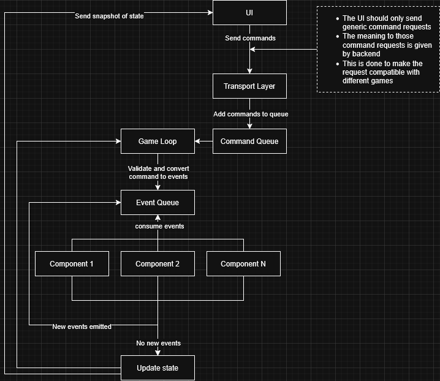
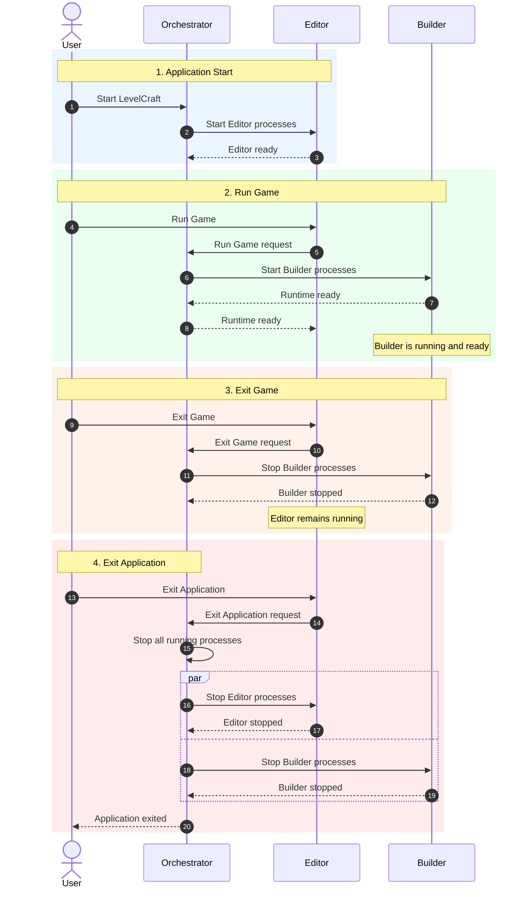

#  <p align = "center">LevelCraft</p>

LevelCraft is a **no-code game engine for creating games without having to build the engine yourself**.

It is being built around a simple idea: creators should be able to define games through **entities, components, interactions, rules, and state**, while LevelCraft handles the underlying systems required to build and run them.

The goal is to shorten the distance between **an idea and a playable game** — giving creators more time to design, experiment, and iterate, and less time engineering the machinery underneath.

**Create. Compose. Play.**

## Why LevelCraft?

Creating a game shouldn't begin with building the technology needed to create one.

A simple game idea can quickly turn into engineering work — managing entities, state, events, persistence, runtime systems, and the countless pieces of infrastructure that sit between an idea and something playable.

LevelCraft is built to move that complexity **from the creator to the engine**.

The creator should think about:

```text
What exists?
What can happen?
How do things interact?
What makes this game fun?
```
not how to implement the machinery that makes those things possible.

The goal is to make the path from `idea → game → play` shorter, simpler, and more accessible.

```
Less time building the engine. More time building the game.
```

 ## How it works

 LevelCraft is built as a set of cooperating systems with clear responsibilities.

 The **Orchestrator is the application entry point**. It starts LevelCraft and manages the lifecycle of the processes that make up the application, including the Editor.

 The **Editor** is where the game is authored.

 The **Builder** prepares the authored game for execution.

 The **Runtime** executes the game.

 The goal is for these systems to feel like one application while remaining clearly separated underneath:

```
Create → Build → Play → Iterate
```

### Builder Architecture



 ### Complete Application Flow



> For the deeper architecture, implementation details, and design decisions, see [docs](./docs/).

## Where It Stands Today

**Early development**

LevelCraft is currently focused on connecting its core systems into a working game creation pipeline.

The foundation is being built around four application flows:

```text
Application Start
      ↓
Orchestrator
      ↓
Editor Processes


Run Game
      ↓
Builder Processes
      ↓
Runtime Ready


Exit Game
      ↓
Builder Processes Stop


Exit Application
      ↓
All Running Processes Stop
```

The individual pieces are taking shape. The current focus is making these flows reliable, predictable, and work together as one application.

LevelCraft is not production-ready yet. The architecture, APIs, and internal abstractions are expected to evolve as the engine is built and exercised.

What to Expect
- Core systems are actively being developed
- End-to-end application flows are being connected
- APIs and architecture may change
- Some functionality is incomplete or experimental
- Documentation will evolve alongside the implementation

The immediate goal is to establish a solid foundation for the no-code game creation experience that LevelCraft is ultimately being built for, while adding components and other directly usable functionalities incrementally.
